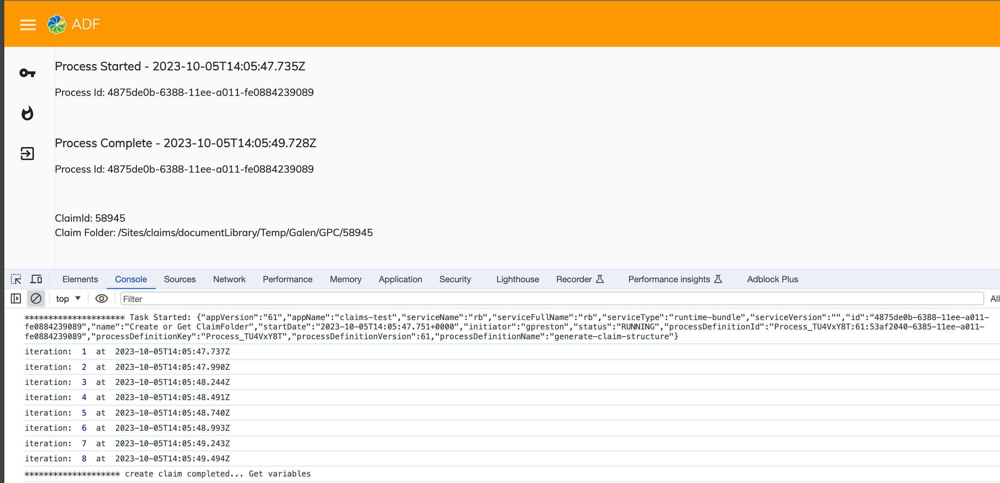
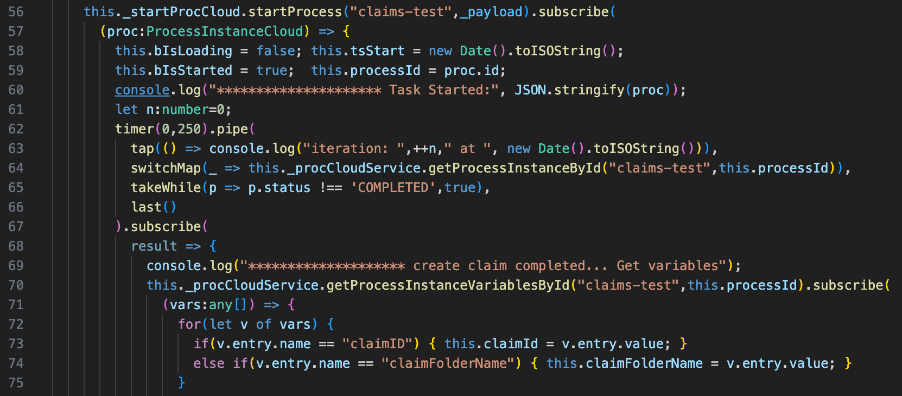

# TypeScript/rxjs Polling for APA process completion and/or data change

Start an APA process - generate claim structure and pass in basic information. The process generates a random
5 digit `claimID` and builds a claim folder structure in the `baseClaimsPath` root of the form:

`baseClaimsPath/companyName/claimID`

Input parameters:

* companyName
* [baseClaimsPath] - default in APA process of `/Sites/claims/documentLibrary/Temp/Galen`

The process initiation returns an observable of type \<ProcessInstanceCloud\>

**The goal is to poll for the processes completion and return the generated `claimId` and `claimFolderName` (derived from the base path, company, and claimID).**

## Special Requirement

I haven't found a way to query a process instance's variables in the OOTB ADF services. To that end I extend the `ProcessCloudService` to add the method `getProcessInstanceVariablesById()`.

Also, the default angular.json that comes with the yeoman project has an incorrect value in the schematic for component.
The default project has uses `styleext` and current angular versions use `style` instead. The proper setting is show below.
You would only encounter this when using `ng generate component my-component-name`.

```json
  "schematics": {
    "@schematics/angular:component": {
      "prefix": "app",
      "style": "scss"
    },
```

## Quick start

```sh
npm install
npm start
```

## Supported ADF component libraries

This project has all the existing ADF component libraries already pre-configured.

The main focus of the project is:

* ADF integration and setup
* Basic demonstration of working components

## Development server

Run `ng serve` for a dev server. Navigate to `http://localhost:4200/`. The app will automatically reload if you change any of the source files.

### General configuration

1. APA on the SSE instance requires using OAUTH authentication. The setting `"authType": "OAUTH"` must appear in the `app.config.json`.
1. APA is built on a verison of Activiti which needs the following stanza, also in `app.config.json` to contain the list of applications the ADF app will be referencing.

    ```json
      "alfresco-deployed-apps": [
        {"name": "apa-app-name-1"},
        {"name": "apa-app-name-2"}
      ]
      ```

### Proxy settings

The template provides certain proxy settings to allow running web application locally without CORS setup.
You can find details in the `proxy.conf.json` file.

List of URLs being proxied:

* `/` -> `https://sse.dev.alfrescocloud.com`
* `/auth/realms/myrealm` -> `https://sse.dev.alfrescocloud.com`
* `/auth/admin/realms/myrealm` -> `https://sse.dev.alfrescocloud.com`
* `/alfresco` -> `https://sse.dev.alfrescocloud.com`

## Code scaffolding

Run `ng generate component component-name -m app.module` to generate a new component. You can also use `ng generate directive|pipe|service|class|module`.

## Build

Run `ng build` to build the project. The build artifacts will be stored in the `dist/` directory. Use the `-prod` flag for a production build.

## Running unit tests

Run `ng test` to execute the unit tests via [Karma](https://karma-runner.github.io).

## Results

All the work happens in the [gen-claim](./src/app/gen-claim/) component.



The 'polling' action is in lines 62 - 67.



Once the process is started,

* Use [timer](https://rxjs.dev/api/index/function/timer) to emit an observable immediately and then every 250ms.
* [switchMap](https://rxjs.dev/api/index/function/switchMap) invokes `getProcessInstanceById()`, returning the inner observable.
* The [takeWhile](https://rxjs.dev/api/index/function/takeWhile) re-emits as long as the condition is satisfied.
* And finally the [last](https://rxjs.dev/api/index/function/last) operator consumes all but the last inner observable.
* Once the `getProcessInstanceById()` emits its last, the subscription on line 67 satisfied and the overall process continues to grab the final process variables from the completed process instance.
